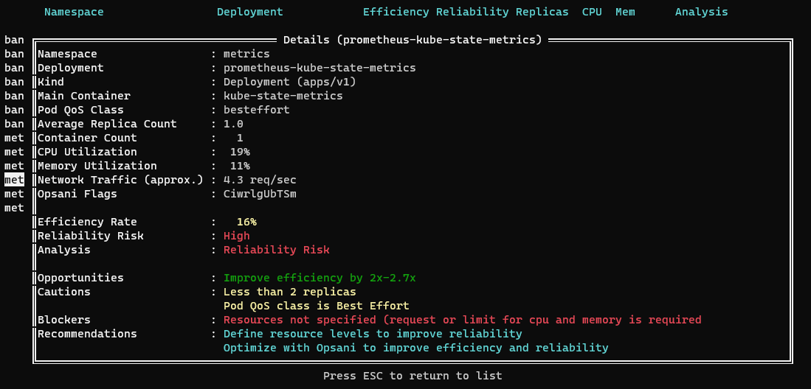

# Opsani Ignite for Kubernetes

[](https://github.com/opsani/opsani-ignite/releases/latest)
[](https://goreportcard.com/report/github.com/opsani/opsani-ignite)
[](LICENSE)
[](https://github.com/mkenney/software-guides/blob/master/STABILITY-BADGES.md#alpha)
[](https://github.com/opsani/opsani-ignite/releases/latest)

Opsani Ignite analyzes applications running on a Kubernetes cluster in order to 
identify _performance and reliability risks_, as well as _inefficient configurations_. It then identifies specific _corrective actions_ that align the application's configuration with deployment best practices for production environments and may also reduce the application's _resource footprint_.

CAUTION: Opsani Ignite is a new tool, still in alpha. We appreciate [feedback and suggestions](#feedback-and-suggestions).

# Download and Install Ignite

To install `opsani-ignite`, download the binary for your OS (macOS, Linux or Windows) from the [latest release](https://github.com/opsani/opsani-ignite/releases/latest) and place it somewhere along your shell's path. Check back often as we release updated analysis capabilities frequently; if your version is more than a week old, please see if a newer version is available before using it.

# Run Ignite

To run Opsani Ignite, you will first want to set up port forwarding to the Prometheus API on your cluster. A typical command looks like this (assuming your Prometheus is called `prometheus-server` and runs in the `prometheus` namespace):

`kubectl port-forward service/prometheus-server 9090:80 -n prometheus`

Once port forwarding is active, run the `opsani-ignite` executable, providing the URL to the port-forwarded Prometheus API:

`opsani-ignite -p http://localhost:9090`

Opsani Ignite works in three phases: discovery, analysis and recommendations.

## Phase 1: Discovery

On startup, Ignite discovers the applications running on the Kubernetes cluster. By querying your Prometheus monitoring system, Ignite finds all non-system namespaces and the deployment workloads running in them; it then obtain their key settings and metrics. 


By default, Ignite looks at the last 7 days of metrics for each application to capture most daily and weekly load and performance variations.

## Phase 2: Analysis

Ignite analyzes each application, looking at pods and containers that make up the application in order to uncover specific omissions of best practices for reliable production deployments. It looks at important characteristics such as the pod's quality of service (QoS), replica count, resource allocation, usage, limits, and processed load. Ignite then identifies areas requiring attention that are either causing or can cause performance and reliability issues.


In addition, Ignite determines whether the application is overprovisioned and has a higher-than-necessary cloud spend. In these cases, it also estimates the likely savings that can be obtained through optimization.

## Phase 3: Recommendations

When an application is selected (pressing Enter in the table of apps), Ignite produces a set of actionable recommendations for improving the efficiency, performance, and reliability of the application. The recommendations fall into several categories, including production best practices (for example, setting resource requests and limits), as well as optimal and resilient operation optimization recommendations. Applying these recommendations results in improved performance and efficiency, as well as increased resilience of their applications under load.



# Optimization Recommendations

Opsani Ignite provides analysis and a number of additional recommendations to improve performance, reliability and efficiency. 

Best practices require correctly setting resource requirements in a way that meets the performance and reliability requirements of an application (typically, latency and error rate service level objectives), while using assigned resources efficiently to control cloud costs. These values can be discovered manually, often through an onerous and repetitive manual tuning process. 

They can also be automatically identified using automatic optimization services, such as the Opsani optimization-as-a-service tool. Those who are interested in how continuous optimization can remediate these issues can go to the [Opsani website](https://opsani.com), set up a [free trial account](https://opsani.com/create-your-account2/#ignite-readme) and attach the optimizer to their application. Connecting an application to the optimizer typically takes 10-15 minutes and, in a few hours, produces concrete, tested resource specifications that can be applied using a simple `kubectl` command.

# Interactive... Stdout... or YAML output

By default, Ignite is text-based interactive tool (using the fantastic [tview](https://github.com/rivo/tview) package, familiar to those who use the equally magnificent [k9s](https://github.com/derailed/k9s) tool). Ignite's command line options can change the output to simple stdout text view and even full-detail YAML output that can be used to integrate Ignite into your dashboards and higher level tools.

# Command Line Options

Here are Ignite's command line options:

```
Usage:
  opsani-ignite [<namespace> [<deployment>]] [flags]

Flags:
      --config string           config file (default is $HOME/.opsani-ignite.yaml)
  -p, --prometheus-url string   URI to Prometheus API (typically port-forwarded to localhost using kubectl)
      --start string            Analysis start time, in RFC3339 or relative form (default "-7d")
      --end string              Analysis end time, in RFC3339 or relative form (default "-0d")
      --step string             Time resolution, in relative form (default "1d")
  -o, --output string           Output format (interactive|table|detail|yaml|servo.yaml)
  -b, --hide-blocked            Hide applications that don't meet optimization prerequisites
      --debug                   Display tracing/debug information to stderr
  -q, --quiet                   Suppress warning and info level messages
  -h, --help                    help for opsani-ignite
```

# Feedback and Suggestions

The Ignite tool is the result of analyzing thousands of applications as part of our work at Opsani. We released it as an open source tool in order to share our experience and learning with the Kubernetes community and help improve application reliability and efficiency. The source code is available to review and to contribute.

We appreciate your feedback. Please send us a few lines about your experience--or, even better--a screenshot &#x1F4F7; with the results (be they good or not so good) at . Issues and PRs are also a great way to help improve Ignite for everyone.

# Troubleshooting 

Opsani Ignite records diagnostic information in `opsani-ignite.log`. You can increase the logging level by adding the `--debug` option to the command line; running the YAML output option (`-o yaml`) is also a great way to see the full details.

# Where To Get Help

You can reach out to Opsani Technical support at  or, for faster response, use the chat bot &#x1F4AC; on the [Opsani web site](https://www.opsani.com).
